# 利用手順

この文書では，**VST-NJ8に基づく高校生向けオンライン版語彙サイズテスト（GDGT）** の利用手順を説明します。

> **コピー用スプレッドシート**  
 [README.md](README.md)のリンクからコピーしてください。

  

## 1. スプレッドシートをコピーする

上記のコピー用リンクを開くと，ブラウザ画面にGoogle スプレッドシートが表示されます

※Googleにログインしていない場合は、ログインしてください

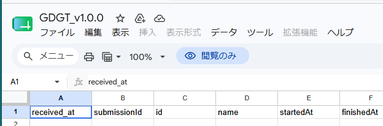

  

メニューの「ファイル」から「コピーを作成」を選択します

※Googleにログインしていない場合は「コピーを作成」が選択できませんので、ログインしてください。

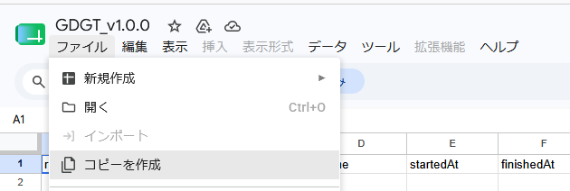

  

コピー名の入力およびフォルダを選択するダイアログが表示されるので、入力・選択をします  

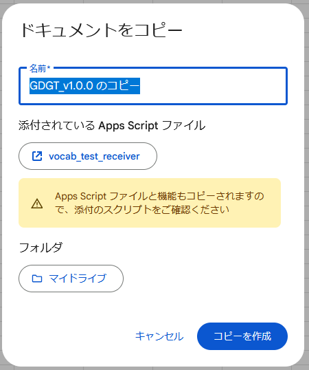

  

ブラウザの新しいタブ・画面にコピーしたスプレッドシートが表示されます（このスプレッドシートは、コピー時に指定した**ご自身のGoogleドライブ内に保存**されています）

※コピーしたスプレッドシートには、ご自身で共有設定を行わない限り、開発者を含む他者はアクセスできません

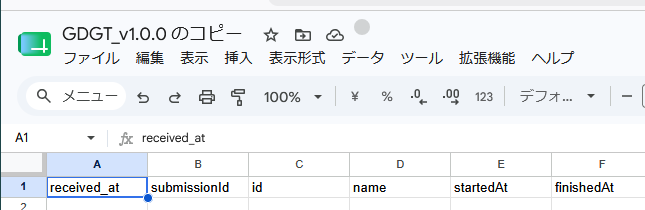

テスト実施後の回答結果は，このコピーしたスプレッドシート（シート名は「**data**」）に保存されます。

  

## 2. Apps Script を開く

プログラムコードが記載されたエディタを開きます。

コピーしたスプレッドシートで，**拡張機能 > Apps Script** を選択します。

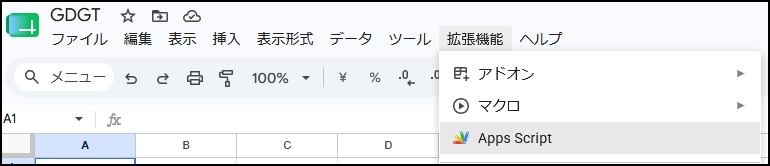

Apps Script エディタが開きます。テスト本体を構成する `code.gs`，`index.html`，`data.txt`，`vst_nj8_parameters.json`，`ItemEstimate.txt` などは，Google スプレッドシート内の Apps Script プロジェクトに含まれています。

  

## 3. Web アプリとしてデプロイ（公開設定）する

Apps Script エディタ右上の **デプロイ** をクリックし，**新しいデプロイ** を選択します。

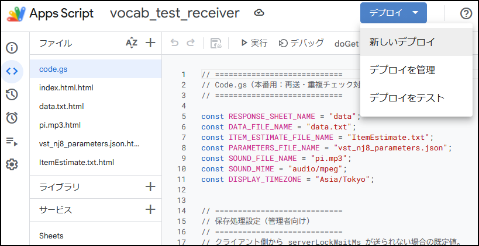

設定画面で，種類として **ウェブアプリ** を選択し，以下のように設定します。

| 設定項目 | 推奨設定 |
|---|---|
| 説明 | 例：`初回公開`，`授業用デプロイ` など |
| 次のユーザーとして実行 | 自分 |
| アクセスできるユーザー | 全員 |

※「アクセスできるユーザー」は、公開した語彙テストにアクセスできるユーザーを指定する設定です。回答を保存するスプレッドシートへのアクセス権を設定するものではありません。

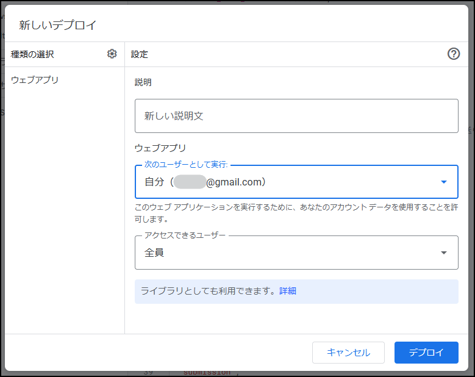

設定後，**デプロイ** をクリックします。

  

## 4. 初回認証を行う

初回デプロイ時には，データへのアクセス許可を求める画面が表示されます。**アクセスを承認** をクリックします。

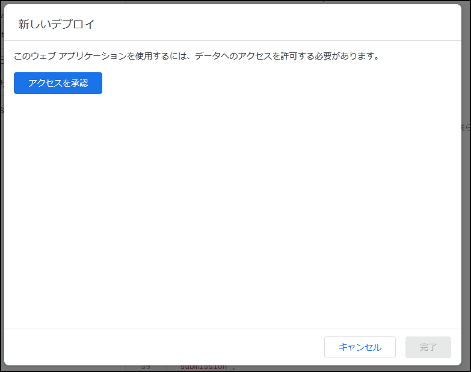

  

Google の警告画面が表示される場合があります。

本アプリを使用する場合は，内容を確認したうえで **Advanced** をクリックします。

※本アプリは、コピーした本スプレッドシートのみを処理対象としており、Googleドライブ内にある他のスプレッドシートを参照・変更することはありません。

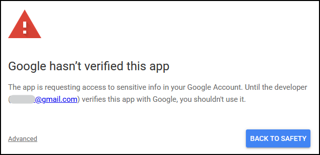

  

次に，**Go to vocab_test_receiver (unsafe)** をクリックします。

※「**unsafe**」は、Googleによる確認を受けていないアプリに対して表示されます。

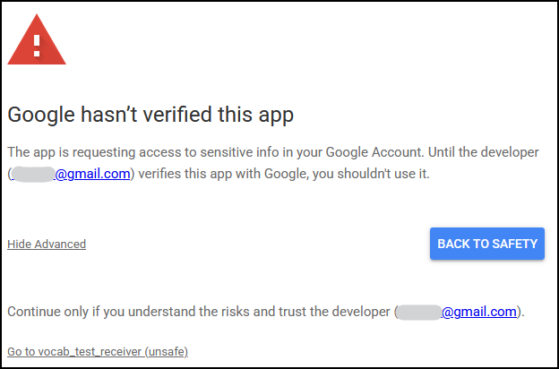

  

権限確認画面が表示されたら，内容を確認し，**Continue** をクリックします。

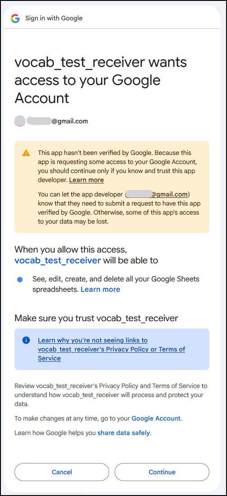

この権限は，回答結果をコピー先の Google スプレッドシートに保存するために必要です。学校・組織のアカウントで使用する場合は，所属機関の Google Workspace 管理方針に従ってください。

  

## 5. Web アプリ URL をコピーする

デプロイが完了すると，ウェブアプリ URL が表示されます。**コピー** をクリックして URL を保存します。

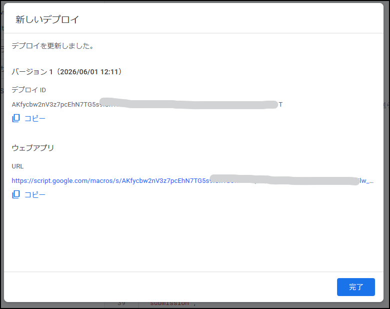

この URL を受験者に通知します（メールやQRコードなどで）。

  

## 6. 受験画面と保存を確認する

Web アプリ URL にアクセスし，開始画面が表示されることを確認します。

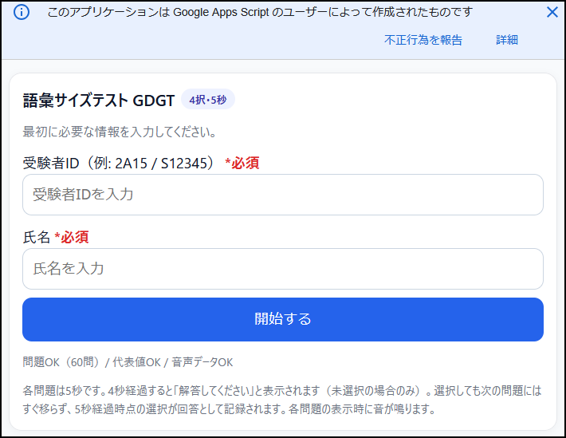

  

テスト終了後，受験者の画面には正答数，問題数，正答率，正答率ベース語彙サイズ，IRT 推定語彙サイズなどが表示されます。教員は、自分のスプレッドシード（**data**）を確認します。

受験データは「data」シートの最後の行に追記されていきます。データ送信時に「data」シートがない場合は、自動で「data」シートが作成されます。

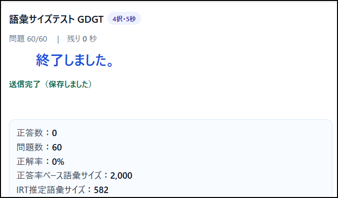

  

画面に **送信完了（保存しました）** と表示されていれば，回答結果がスプレッドシートに保存されています。

  

## 7. 送信が完了しない場合

2分経過しても送信完了しない場合は，次のダイアログが表示されます。この場合は，**ダウンロード**または**再送**を選択します。

**再送する**を選択した場合は再送を行い、その後15秒以内に送信が完了しなければ、同じダイアログが再度表示されます。

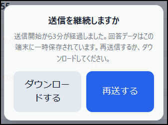

  

**再送**を選択しても送信完了しない場合は，**ダウンロード**を選択してください。回答データ（csvおよびjson）が受験者の端末にダウンロードされますので，未送信データを後から補完できます。

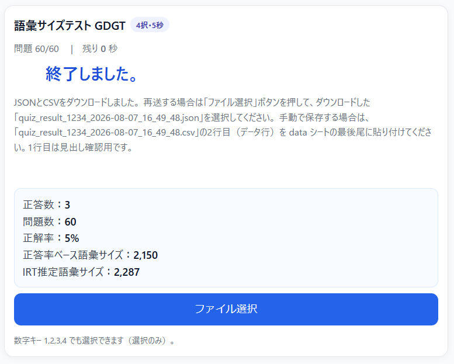

  

## 8. 未送信のまま画面を閉じた場合

受験後、未送信のまま画面を閉じた場合、同じブラウザで再度テストを開くと、「未送信データを再送」ボタンが表示されます。

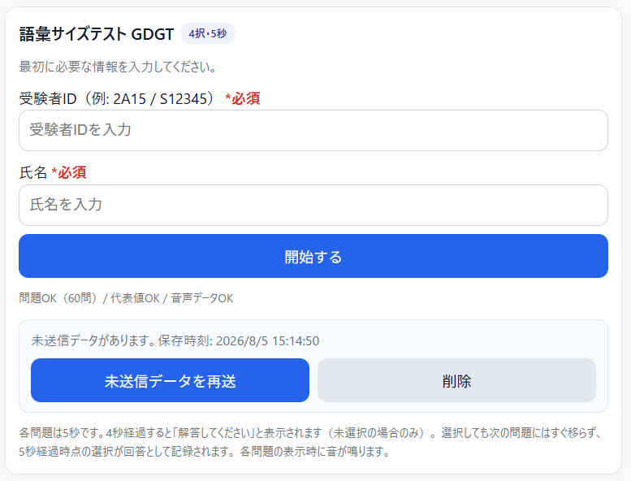

「未送信データを再送」ボタンが表示されるので、それを押すことでデータが送信されます。

  

## 9. スプレッドシートの確認と運用

教員のスプレッドシートでは，シート名 **data** のシートに受験者データが集約されます。

受験データは「data」シートの最後の行に追記されていきます。データ送信時に「data」シートがない場合は、自動で「data」シートが作成されます。

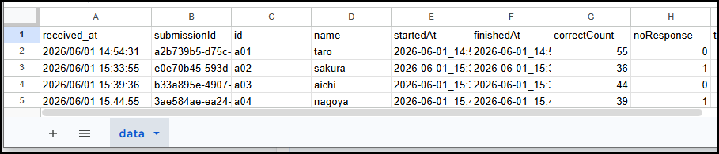

一定数の受験（例えば，1つのクラス）が終了したら，シートをコピーし，適切な名前に変更して保存しておく運用を推奨します。

次のクラスでテストを実施する前には，**data** シートのデータを初期状態に戻しておくことを推奨します。初期状態では，1行目のラベルのみを残し，2行目以降の受験者データを削除します（初期化は、メニューから自動でもできます：「10. スプレッドシートの自動初期化」参照）。

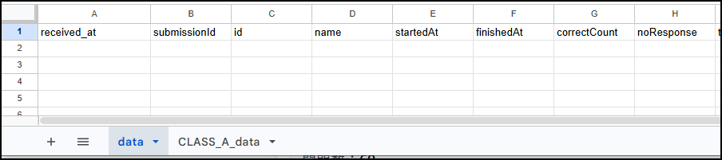

  

## 10. 「data」シートの自動初期化

**data** シートの初期化はメニューの「GDGT管理」を選択し「新規データシートの作成」を押すと自動で新規dataシートが作成されます。その際、もとのdataシートはフォームに入力した任意のシート名でコピーされます。

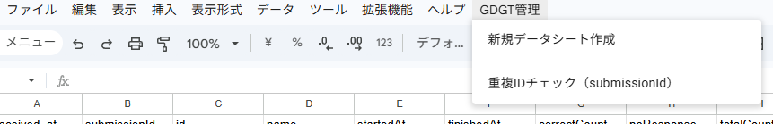
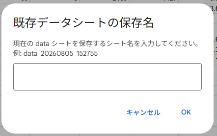

